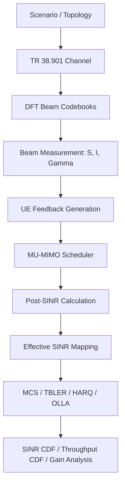
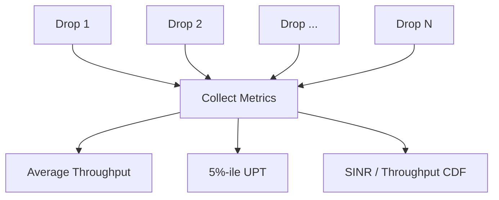

# Sionna SLS 波束管理与 MU-MIMO 调度仿真计划 v4

> 目标：基于 Sionna 搭建一个与 3GPP/RAN1 SLS 假设尽量对齐的系统级仿真平台，验证 UE 上报波束间干扰/兼容信息后，是否能够提升 MU-MIMO 用户分组、服务波束选择和系统吞吐。  
> 本文档重点定义数学模型、仿真条件、仿真流程、调度接口、链路抽象方法，以及 Sionna 可复用模块和需要自研的模块。

---

## 目录

- [1. 仿真背景与目标](#sec-1)
  - [1.1 传统波束测量与上报的问题](#sec-1-1)
  - [1.2 本方案关注的问题](#sec-1-2)
  - [1.3 平台验证目标](#sec-1-3)
- [2. 数学建模：波束、Gamma 矩阵与调度问题](#sec-2)
  - [2.1 基本对象与索引](#sec-2-1)
  - [2.2 服务功率与干扰功率](#sec-2-2)
  - [2.3 Gamma 矩阵定义：对角线为 SNR，非对角线为 pair-SINR](#sec-2-3)
  - [2.4 多用户同时调度下的实际 SINR](#sec-2-4)
  - [2.5 调度变量、硬件约束与优化目标](#sec-2-5)
  - [2.6 调度器输出](#sec-2-6)
- [3. 上报信息设计](#sec-3)
  - [3.1 最完整上报：完整 Gamma 矩阵](#sec-3-1)
  - [3.2 基线 1：服务波束 CQI 或 RSRP 上报](#sec-3-2)
  - [3.3 增强 1：Top-k 服务波束 + Top-k 强干扰源 ID](#sec-3-3)
  - [3.4 增强 2：Top-k 服务波束 + 门限强干扰源集合](#sec-3-4)
  - [3.5 上报方案总览与完整波束扫描前提](#sec-3-5)
  - [3.6 CQI 上报与 MCS surrogate CQI](#sec-3-6)
- [4. 与 3GPP 对齐的可配置仿真条件](#sec-4)
  - [4.1 场景与 layout](#sec-4-1)
  - [4.2 多小区统计方式](#sec-4-2)
  - [4.3 信道模型](#sec-4-3)
  - [4.4 基站发射功率](#sec-4-4)
  - [4.5 UE 分布与关联](#sec-4-5)
  - [4.6 BS/TRP/sector/panel 建模](#sec-4-6)
  - [4.7 TRP antenna 配置](#sec-4-7)
  - [4.8 UE antenna 配置](#sec-4-8)
  - [4.9 Beam model](#sec-4-9)
  - [4.10 MU-MIMO scheme](#sec-4-10)
- [5. 仿真方法与流程](#sec-5)
  - [5.1 总体流程图](#sec-5-1)
  - [5.2 拓扑与信道生成](#sec-5-2)
  - [5.3 波束建模](#sec-5-3)
  - [5.4 波束测量：不做真实扫描，直接计算等效测量量](#sec-5-4)
  - [5.5 反馈生成](#sec-5-5)
  - [5.6 MU-MIMO 调度器](#sec-5-6)
  - [5.7 post-SINR 与 effective SINR](#sec-5-7)
  - [5.8 TBLER、HARQ、OLLA 与吞吐统计](#sec-5-8)
  - [5.9 多 drop 统计](#sec-5-9)
- [6. 评价指标](#sec-6)
- [7. 参数文件建议](#sec-7)
- [8. Sionna 可复用模块与需要开发的模块](#sec-8)
  - [8.1 可直接复用](#sec-8-1)
  - [8.2 需要基于 Sionna 扩展/开发](#sec-8-2)
  - [8.3 模块开发需求表](#sec-8-3)
- [9. 分阶段开发计划](#sec-9)
- [10. 参考资料](#sec-10)

---

<a id="sec-1"></a>

## 1. 仿真背景与目标

<a id="sec-1-1"></a>

### 1.1 传统波束测量与上报的问题

传统波束测量可以抽象为 BS 配置一组 CMR-IMR 测量资源：

- CMR：channel measurement resource，用潜在服务波束发射，用于测量服务信号质量；
- IMR：interference measurement resource，用潜在干扰波束发射，用于测量该干扰波束对 UE 当前服务接收状态的干扰。

UE 对每个 CMR 服务波束扫描自身接收波束，选择最适合接收该 CMR 的接收波束。随后 UE 使用这个接收波束测量对应 IMR 的干扰功率。

如果 BS 侧有 $$M$$ 个潜在服务波束、$$N$$ 个潜在干扰波束，UE 侧每个 CMR 需要扫描 $$K$$ 个接收波束，则理想完整测量开销可以写为：

$$
K M + M N .
$$

传统一对一 CMR-IMR 配置下，UE 看到的往往是逻辑 CMR ID。一个逻辑 CMR ID 实际可能对应一个底层物理 pair：

$$
\ell = (m,n),
$$

其中 $$m$$ 是 CMR 服务波束，$$n$$ 是 IMR 干扰波束。传统上报通常反馈若干个逻辑 CMR ID 及其质量，例如最强 SINR 的若干个逻辑 CMR。

这种方式的问题是：

> 调度器知道某些逻辑波束质量较好，但不一定知道底层物理服务波束与潜在干扰波束之间的完整兼容/冲突关系。

对于 MU-MIMO 调度，调度器真正需要知道的是：

> 如果 UE $$u$$ 使用服务波束 $$m$$，其他 UE 是否可以同时使用波束 $$n$$？

这正是传统上报信息不足的地方。

<a id="sec-1-2"></a>

### 1.2 本方案关注的问题

本方案关注的是 **MU 用户分组与服务波束选择的准确性**。更准确地说，调度器需要根据 UE 上报信息，为部分用户分配服务波束，使得所有被调度用户的理论吞吐最大。

核心问题不是简单选择每个 UE 的最强服务波束，而是选择一组可以共存的用户-波束组合：

$$
(u_1,b_{u_1}), (u_2,b_{u_2}), \ldots, (u_Q,b_{u_Q}).
$$

其中 $$b_u$$ 是分配给 UE $$u$$ 的服务波束。由于不同用户的服务波束会互相产生 beam-domain interference，因此单用户最优波束组合未必是多用户最优组合。

<a id="sec-1-3"></a>

### 1.3 平台验证目标

本仿真平台需要验证：

1. 在有限反馈开销下，proposed 上报量能否更准确地描述 beam-pair 兼容关系；
2. 调度器基于 proposed 上报信息，能否更接近完整 $$\Gamma$$ 矩阵 oracle 的调度结果；
3. proposed 上报能否降低被调度 MU 用户之间的实际 inter-beam interference；
4. proposed 上报能否提升平均吞吐、5%-ile UE 吞吐和 SINR CDF；
5. 在 OLLA/HARQ 统计闭环下，该增益是否仍然存在。

---

<a id="sec-2"></a>

## 2. 数学建模：波束、Gamma 矩阵与调度问题

<a id="sec-2-1"></a>

### 2.1 基本对象与索引

系统中一个物理波束用如下索引表示：

$$
b = (c,t,p,k),
$$

其中：

- $$c$$：cell/sector ID；
- $$t$$：TRP ID；
- $$p$$：panel ID；
- $$k$$：该 panel 内的 beam ID。

在 baseline 中，可以取：

$$
1 \ \text{sector} = 1 \ \text{cell} = 1 \ \text{TRP},
$$

因此可以简化为：

$$
b = (c,p,k).
$$

如果一个 TRP 只有一个 panel，则进一步简化为：

$$
b = (c,k).
$$

对 UE $$u$$，TRP/panel/beam $$b$$ 对应的发射模拟波束向量记为：

$$
\mathbf f_b .
$$

UE 侧接收波束候选集合为：

$$
\mathcal Q_u = \{\mathbf q_{u,1}, \mathbf q_{u,2}, \ldots, \mathbf q_{u,K}\}.
$$

从物理传输点 $$b$$ 所属的 TRP/panel 到 UE $$u$$ 的 MIMO 信道记为：

$$
\mathbf H_{u,b}(f),
$$

其中 $$f$$ 表示频域位置，可以是子载波、PRB 或 subband。

<a id="sec-2-2"></a>

### 2.2 服务功率与干扰功率

对 UE $$u$$，若使用服务波束 $$m$$，UE 先在自身接收波束集合中选择最强接收波束：

$$
k_{u,m}^{\star}
=
\arg\max_{k}
\frac{1}{|\mathcal F_{\mathrm{CMR}}|}
\sum_{f\in\mathcal F_{\mathrm{CMR}}}
\left|
\mathbf q_{u,k}^{H}
\mathbf H_{u,m}(f)
\mathbf f_m
\right|^2 .
$$

对应接收波束为：

$$
\mathbf q_{u,m}
=
\mathbf q_{u,k_{u,m}^{\star}} .
$$

服务功率定义为：

$$
S_u(m)
=
\frac{P_m}{|\mathcal F_{\mathrm{CMR}}|}
\sum_{f\in\mathcal F_{\mathrm{CMR}}}
\left|
\mathbf q_{u,m}^{H}
\mathbf H_{u,m}(f)
\mathbf f_m
\right|^2 .
$$

其中 $$P_m$$ 是 CMR/服务波束 $$m$$ 的发射功率。

当另一个潜在干扰波束 $$n$$ 发射时，其对 UE $$u$$ 在接收服务波束 $$m$$ 状态下造成的干扰功率为：

$$
I_u(m,n)
=
\frac{P_n}{|\mathcal F_{\mathrm{IMR}}|}
\sum_{f\in\mathcal F_{\mathrm{IMR}}}
\left|
\mathbf q_{u,m}^{H}
\mathbf H_{u,n}(f)
\mathbf f_n
\right|^2 .
$$

噪声功率记为：

$$
N_u = \sigma_u^2 .
$$

<a id="sec-2-3"></a>

### 2.3 Gamma 矩阵定义：对角线为 SNR，非对角线为 pair-SINR

对 UE $$u$$，定义 $$\Gamma_u$$ 矩阵。若 CMR 服务波束集合与 IMR/潜在干扰波束集合使用相同物理 beam 索引，则 $$\Gamma_u$$ 可以看成方阵；否则它是一个 $$M\times N$$ 的矩阵，此时“对角线”只对共享物理 beam 索引的元素有意义。

对于非对角线元素 $$m\neq n$$，$$\Gamma_u(m,n)$$ 表示：

> UE $$u$$ 使用服务波束 $$m$$ 时，若另一个用户/传输点使用波束 $$n$$，UE $$u$$ 看到的 pair-level SINR。

定义为：

$$
\Gamma_u(m,n)
=
\frac{
S_u(m)
}{
I_u(m,n)+N_u
},
\qquad m\neq n.
$$

对于对角线元素，不能把 $$n=m$$ 理解为“同一个物理 beam 同时作为服务波束和干扰波束”。在同一个 TRP panel 同一个资源上，一个 panel 只能发射一个波束，因此同一个 beam 不会同时服务本 UE 又作为另一个独立干扰源。对角线元素应定义为服务 beam 的单用户 SNR：

$$
\Gamma_u(m,m)
=
\mathrm{SNR}_u(m)
=
\frac{
S_u(m)
}{
N_u
}.
$$

因此，$$\Gamma_u$$ 的物理含义是：

$$
\Gamma_u(m,n)
=
\begin{cases}
\dfrac{S_u(m)}{N_u}, & m=n,\\[1.2em]
\dfrac{S_u(m)}{I_u(m,n)+N_u}, & m\neq n.
\end{cases}
$$

如果 $$\Gamma_u(m,n)$$ 越大，表示服务 beam $$m$$ 与潜在干扰 beam $$n$$ 越容易共存；如果 $$\Gamma_u(m,n)$$ 越小，表示该 pair 对 UE $$u$$ 来说冲突越严重。

<a id="sec-2-4"></a>

### 2.4 多用户同时调度下的实际 SINR

假设调度器选择用户集合：

$$
\mathcal U_{\mathrm{sch}}
=
\{u_1,u_2,\ldots,u_Q\},
$$

并为每个 UE $$u$$ 分配服务波束 $$b_u$$。UE $$u$$ 的实际多用户 SINR 为：

$$
\gamma_u
=
\frac{
S_u(b_u)
}{
N_u+
\sum_{v\in\mathcal U_{\mathrm{sch}}, v\neq u}
I_u(b_u,b_v)
}.
$$

注意，$$\Gamma_u(m,n)$$ 是 pair-level 信息，而真实 MU-MIMO SINR 需要把多个被调度用户的干扰叠加：

$$
N_u+
\sum_{v\neq u}I_u(b_u,b_v).
$$

如果调度器知道完整 $$\Gamma_u$$ 且知道 $$S_u(m)$$、$$N_u$$，则可以从非对角线元素反推 pairwise interference：

$$
I_u(m,n)
=
\frac{S_u(m)}{\Gamma_u(m,n)}
-
N_u,
\qquad m\neq n.
$$

这使完整 $$\Gamma$$ 矩阵可以用于构造 oracle 调度器。

<a id="sec-2-5"></a>

### 2.5 调度变量、硬件约束与优化目标

本仿真中的调度器不是简单地给每个 UE 选一个最强波束，而是在一个给定的**调度域**内，同时决定：调度哪些 UE、每个 UE 使用哪个服务波束、每个 UE 使用哪个 MCS，并满足 TRP/panel 的模拟波束发射约束。

#### 2.5.1 调度域定义

定义一个调度域：

$$
\mathcal D
=\left(\mathcal C_{\mathcal D},\mathcal T_{\mathcal D},\mathcal P_{\mathcal D},\mathcal U_{\mathcal D}\right),
$$

其中：

- $$\mathcal C_{\mathcal D}$$：参与调度的 cell/sector 集合；
- $$\mathcal T_{\mathcal D}$$：参与调度的 TRP 集合；
- $$\mathcal P_{\mathcal D}$$：参与调度的 TRP panel 集合；
- $$\mathcal U_{\mathcal D}$$：该调度域内的候选 UE 集合。

每个物理服务波束写为：

$$
b=(c,t,p,k),
$$

其中 $$(c,t,p)\in\mathcal P_{\mathcal D}$$，$$k$$ 是该 panel 内的 beam index。调度域内可用 beam 集合为：

$$
\mathcal B_{\mathcal D}
=
\left\{(c,t,p,k):(c,t,p)\in\mathcal P_{\mathcal D},\ k\in\mathcal K_{c,t,p}\right\}.
$$

不同调度模式对应不同的 $$\mathcal D$$：

| 调度模式 | $$\mathcal C_{\mathcal D}$$ | $$\mathcal T_{\mathcal D}$$ | 含义 |
|---|---|---|---|
| 单小区独立调度 | 单个 sector/cell | 该 cell 内 TRP | 每个 cell 独立调度 |
| 单站点多小区联合调度 | 同一 site 的 3 个 sector/cell | 该 site 内 3 个 TRP | 一个 site 内跨 sector 联合选 UE/beam |
| 多站点多小区独立调度 | 每个 cell 分别构造自己的 $$\mathcal D$$ | 各自 TRP | 多小区同时运行独立调度器 |
| 多站点多小区联合调度 | 多个 site 的多个 sector/cell | 多个 site/TRP | coordinated TRP set 内联合调度 |

#### 2.5.2 调度变量

定义二值变量：

$$
x_{u,b}
=
\begin{cases}
1, & \text{UE }u\text{ 被调度并使用服务波束 }b,\\
0, & \text{otherwise}.
\end{cases}
$$

其中：

$$
u\in\mathcal U_{\mathcal D},
\qquad
b\in\mathcal B_{\mathcal D}.
$$

每个 UE 固定单流传输，因此每个 UE 最多选择一个服务波束：

$$
\sum_{b\in\mathcal B_{\mathcal D}}x_{u,b}
\le 1,
\qquad \forall u\in\mathcal U_{\mathcal D}.
$$

若定义 UE 是否被调度为：

$$
y_u=
\sum_{b\in\mathcal B_{\mathcal D}}x_{u,b},
$$

则：

$$
y_u\in\{0,1\}.
$$

#### 2.5.3 TRP/panel 硬件约束

一个 TRP 的一个 panel 在同一时频资源上只能发射一个模拟波束。因此，对任意 panel $$(c,t,p)\in\mathcal P_{\mathcal D}$$，有硬约束：

$$
\sum_{u\in\mathcal U_{\mathcal D}}
\sum_{k\in\mathcal K_{c,t,p}}
 x_{u,(c,t,p,k)}
\le 1,
\qquad \forall (c,t,p)\in\mathcal P_{\mathcal D}.
$$

这个约束非常重要：它意味着即使调度域中有很多 UE，也不一定能把每个 UE 都调度上；可同时调度的 UE 数受到可用 panel 数和每 panel 单 beam 约束限制。

如果还需要限制整个调度域的最大 MU order，则：

$$
\sum_{u\in\mathcal U_{\mathcal D}}
\sum_{b\in\mathcal B_{\mathcal D}}
 x_{u,b}
\le Q_{\max}.
$$

若每个 cell 或 TRP 还有独立的最大流数限制，也可以增加：

$$
\sum_{u}
\sum_{b\in\mathcal B_c}x_{u,b}
\le Q_c,
\qquad \forall c\in\mathcal C_{\mathcal D},
$$

其中 $$\mathcal B_c$$ 是 cell $$c$$ 内所有候选 beam。

#### 2.5.4 优化目标

如果调度器知道完整真实信道和完整 $$S,I$$ 信息，可以写出 full-information 目标：

$$
\max_{\{x_{u,b}\}}
\sum_{u\in\mathcal U_{\mathcal D}}
y_u R_u(\gamma_u),
$$

其中：

$$
\gamma_u
=
\frac{
S_u(b_u)
}{
N_u+
\sum_{v\in\mathcal U_{\mathrm{sch}},v\neq u}
I_u(b_u,b_v)
}.
$$

吞吐函数可以采用香农型近似：

$$
R_u(\gamma_u)
=
B_u\log_2(1+\gamma_u),
$$

也可以采用 NR MCS/TBS 抽象：

$$
R_u(\gamma_u)
=
\mathrm{TBS}_u\left(\mathrm{MCS}_u(\gamma_u)\right).
$$

若采用比例公平调度，则目标变为：

$$
\max_{\{x_{u,b}\}}
\sum_{u\in\mathcal U_{\mathcal D}}
\frac{y_u R_u(\gamma_u)}{\overline T_u},
$$

其中 $$\overline T_u$$ 是 UE $$u$$ 的历史平均吞吐。

但是，实际有限上报调度器站在 BS 角度时，不一定知道特定调度组合下每个 UE 受到的真实总干扰。因此调度器使用的是基于上报信息构造的估计 SINR：

$$
\widehat\gamma_u
=
\frac{
\widehat S_u(b_u)
}{
\widehat N_u+
\sum_{v\in\mathcal U_{\mathrm{sch}},v\neq u}
\widehat I_u(b_u,b_v)
}.
$$

调度器实际最大化的是：

$$
\max_{\{x_{u,b}\}}
\sum_{u\in\mathcal U_{\mathcal D}}
y_u W_u\,\widehat R_u(\widehat\gamma_u),
$$

其中：

$$
W_u=
\begin{cases}
1, & \text{总吞吐最大化},\\
\dfrac{1}{\overline T_u}, & \text{比例公平调度}.
\end{cases}
$$

因此，调度算法的核心不是使用真实 $$I_u(b_u,b_v)$$，而是根据不同上报方案构造 $$\widehat I_u(b_u,b_v)$$ 或 conflict penalty。


<a id="sec-2-6"></a>

### 2.6 调度器输出

调度器的输出必须包括：

1. 被调度 UE 的编号；
2. 每个被调度 UE 的服务波束：
   
   $$
   b_u=(c_u,t_u,p_u,k_u);
   $$

3. 每个被调度 UE 的 MCS；
4. 可选：每个 UE 的预测 SINR、预测吞吐、调度原因或冲突规避原因。

固定单流传输时，每个被调度 UE 只有一个 stream：

$$
N_{s,u}=1.
$$

---

<a id="sec-3"></a>

## 3. 上报信息设计

<a id="sec-3-1"></a>

### 3.1 最完整上报：完整 Gamma 矩阵

最完整的上报是每个 UE 反馈：

$$
\Gamma_u(m,n),
\qquad \forall m,n.
$$

并且为了支持多用户 SINR 叠加，最好同时反馈或内部保存：

$$
S_u(m), \quad N_u.
$$

完整上报可以构造 full-Gamma oracle scheduler，作为有限上报方案的性能上界：

$$
\mathcal S^{\star}_{\mathrm{oracle}}
=
\arg\max_{\mathcal S,\mathbf b}
\sum_{u\in\mathcal S}
R_u
\left(
\frac{
S_u(b_u)
}{
N_u+\sum_{v\neq u}I_u(b_u,b_v)
}
\right).
$$

但完整矩阵开销为：

$$
O(MN),
$$

在标准化或实际反馈中通常不可接受。

<a id="sec-3-2"></a>

### 3.2 基线 1：服务波束 CQI 或 RSRP 上报

本节之后的所有有限上报方案都采用同一个测量前提：**先假定 UE 完成完整的 TX/RX 波束扫描，再基于完整测量结果生成不同形式的上报量**。

也就是说，若一个调度域内 BS/TRP/panel 侧共有 $$M$$ 个候选服务波束，UE 侧共有 $$K$$ 个接收波束，则 UE 完成：

$$
M K
$$

次 TX/RX 波束测量。对于每个 TX beam $$m$$，UE 选择最优 RX beam $$r_{u,m}^{\star}$$，并得到该服务波束的 RSRP/SNR/CQI。若进一步需要干扰关系，则在对应接收波束状态下计算或测量潜在干扰 beam 的 SINR/干扰影响。

基线 1 只上报服务 beam 自身质量，不上报干扰 beam 信息。UE 对每个候选服务 beam $$m$$ 测量：

$$
\mathrm{SNR}_u(m)
=
\frac{S_u(m)}{N_u}.
$$

UE 可以选择上报 CQI 或 RSRP。若上报 CQI，则：

$$
\mathrm{CQI}^{\mathrm{SU}}_u(m)
=
Q_{\mathrm{CQI}}\left(\mathrm{SNR}_u(m)\right).
$$

若上报 RSRP，则：

$$
\mathrm{RSRP}_u(m)
=
S_u(m).
$$

UE 上报 $$k_1$$ 个最强服务 beam：

$$
\mathcal M^{\mathrm{base}}_u
=
\mathrm{Top}\text{-}k_1
\left\{Q_u(m)\right\},
$$

其中 $$Q_u(m)$$ 可以是 $$\mathrm{CQI}^{\mathrm{SU}}_u(m)$$、$$\mathrm{RSRP}_u(m)$$ 或 $$\mathrm{SNR}_u(m)$$。

基线 1 的反馈内容为：

| 项目 | 内容 |
|---|---|
| 服务 beam ID | $$m$$ 或 $$b=(c,t,p,k)$$ |
| 服务质量 | CQI 或 RSRP/SNR |
| 干扰 beam ID | 不上报 |
| pairwise SINR | 不上报 |

调度器只知道每个 UE 的候选服务 beam 及其单用户质量，不知道 beam-pair interference。因此它可能选到单用户都强、但互相干扰严重的用户-波束组合。

<a id="sec-3-3"></a>

### 3.3 增强 1：Top-k 服务波束 + Top-k 强干扰源 ID（TopK-Conflict-ID）

增强 1 命名为 **TopK-Conflict-ID 上报**。它在基线服务波束 CQI/RSRP 上报的基础上，为每个候选服务波束额外上报若干个最强干扰源 ID。

UE 首先选择 $$k_1$$ 个最强服务波束：

$$
\mathcal M^{\mathrm{TCI}}_u
=
\mathrm{Top}\text{-}k_1
\left\{\mathrm{CQI}^{\mathrm{SU}}_u(m)\right\}.
$$

对每个服务波束 $$m\in\mathcal M^{\mathrm{TCI}}_u$$，UE 选择 $$k_2$$ 个最强干扰源。由于普通 SINR 越低表示干扰越强，因此：

$$
\mathcal B^{(k_2)}_u(m)
=
\mathrm{Bottom}\text{-}k_2
\left\{\Gamma_u(m,n)\right\}_{n\neq m}.
$$

等价地，也可以基于干扰功率选择：

$$
\mathcal B^{(k_2)}_u(m)
=
\mathrm{Top}\text{-}k_2
\left\{I_u(m,n)\right\}_{n\neq m}.
$$

UE 上报：

$$
\mathrm{Report}^{\mathrm{TCI}}_u
=
\left\{
\left(
 m,
 \mathrm{CQI}^{\mathrm{SU}}_u(m),
 \mathcal B^{(k_2)}_u(m)
\right)
\right\}_{m\in\mathcal M^{\mathrm{TCI}}_u}.
$$

其中 $$k_1$$ 和 $$k_2$$ 均为可配置参数。

该方案的含义是：如果 UE $$u$$ 使用服务波束 $$m$$，则调度器应尽量避免其他 UE 使用 $$\mathcal B^{(k_2)}_u(m)$$ 中的 beam。

<a id="sec-3-4"></a>

### 3.4 增强 2：Top-k 服务波束 + 门限强干扰源集合（Threshold-Conflict-Set）

增强 2 命名为 **Threshold-Conflict-Set 上报**。它与增强 1 的区别是：增强 1 对每个服务波束固定上报 $$k_2$$ 个最强干扰源，而增强 2 上报所有使 pair-SINR 低于门限的强干扰源 ID。

UE 仍然先选择 $$k_1$$ 个最强服务波束：

$$
\mathcal M^{\mathrm{TCS}}_u
=
\mathrm{Top}\text{-}k_1
\left\{\mathrm{CQI}^{\mathrm{SU}}_u(m)\right\}.
$$

对每个服务波束 $$m\in\mathcal M^{\mathrm{TCS}}_u$$，定义强干扰集合：

$$
\mathcal B^{\mathrm{th}}_u(m)
=
\left\{
 n\neq m:
 \Gamma_u(m,n)<\gamma_{\mathrm{bad}}
\right\}.
$$

其中 $$\gamma_{\mathrm{bad}}$$ 是可配置的 SINR 门限。UE 上报：

$$
\mathrm{Report}^{\mathrm{TCS}}_u
=
\left\{
\left(
 m,
 \mathrm{CQI}^{\mathrm{SU}}_u(m),
 \mathcal B^{\mathrm{th}}_u(m)
\right)
\right\}_{m\in\mathcal M^{\mathrm{TCS}}_u}.
$$

该方案的优点是：如果某一行中强干扰源数量较多，调度器可以得到更完整的 conflict 信息；如果某一行中强干扰源较少，则反馈开销自然降低。

<a id="sec-3-5"></a>

### 3.5 上报方案总览与完整波束扫描前提

所有方案暂时采用相同测量前提：UE 先完成调度域内完整的 TX/RX 波束扫描，即调度域内 BS 侧有 $$M$$ 个候选 TX beam、UE 侧有 $$K$$ 个 RX beam 时，先进行：

$$
M K
$$

次服务波束测量。基于这 $$M K$$ 个测量结果，UE 生成不同上报量。当前阶段暂不比较不同方案的测量开销，只比较**在相同完整测量前提下，不同上报内容对调度性能的影响**。

| 方案 | 服务波束个数 | 服务波束 CQI | 服务波束 RSRP/SNR | 干扰波束个数 | 干扰波束 SINR/取值 | 干扰源 ID | 说明 |
|---|---:|:---:|:---:|---:|:---:|:---:|---|
| Full-Gamma oracle | 全部 $$M$$ | 可选 | 可选 | 全部 $$N$$ | 全部 $$\Gamma_u(m,n)$$ | 全部 | 上界，不考虑反馈开销 |
| 基线 1：CQI/RSRP | $$k_1$$ | ✓ 或 — | ✓ 或 — | 0 | — | — | 只上报服务 beam 质量 |
| 增强 1：TopK-Conflict-ID | $$k_1$$ | ✓ | 可选 | 每行 $$k_2$$ | 可选 | ✓ | 每个服务 beam 上报固定数量强干扰源 |
| 增强 2：Threshold-Conflict-Set | $$k_1$$ | ✓ | 可选 | 每行可变 | 可选 | ✓ | 上报所有低于门限的强干扰源 |

其中：

- $$k_1$$：上报的候选服务波束数量；
- $$k_2$$：每个服务波束上报的最强干扰源数量；
- $$\gamma_{\mathrm{bad}}$$：强干扰 SINR 门限；
- “干扰波束 SINR/取值”如果不上报，则调度器只能知道干扰源 ID，不能知道干扰强弱的连续值。

<a id="sec-3-6"></a>

### 3.6 CQI 上报与 MCS surrogate CQI

标准 NR 中 CQI 是量化后的链路质量指示。仿真中可以采用两种实现方式：

#### 方式 A：标准 CQI index

给定 effective SINR $$\gamma_{\mathrm{eff}}$$，选择最高 CQI index：

$$
\mathrm{CQI}^{\star}
=
\max
\left\{
c:
\mathrm{TBLER}(c,\gamma_{\mathrm{eff}})
\le p_{\mathrm{target}}
\right\}.
$$

其中 eMBB CQI table 通常对应：

$$
p_{\mathrm{target}}=0.1.
$$

#### 方式 B：MCS surrogate CQI

为了简化第一版仿真，也可以直接用 MCS index 作为 CQI surrogate：

$$
\mathrm{MCS}^{\star}
=
\max
\left\{
i:
\mathrm{TBLER}(i,\gamma_{\mathrm{eff}})
\le p_{\mathrm{target}}
\right\}.
$$

此时 UE 上报的 CQI 可以理解为：

> 该 beam 或 beam-pair 在目标 BLER 下可支持的最大 MCS。

第一版建议使用 MCS surrogate CQI，因为它直接对应吞吐计算，并可复用 Sionna 的 link adaptation / PHY abstraction 能力。

#### RSRP/SINR 量化上报

若需要模拟更接近标准的 L1-RSRP / L1-SINR 量化反馈，可采用如下规则。

RSRP，例如 L1-RSRP 和 L1-SRS-RSRP：

| 项目 | 取值 |
|---|---:|
| 绝对值范围 | $$[-140,-44]$$ dBm |
| 绝对值量化步长 | 1 dB |
| 最强 RSRP 上报比特数 | 7 bits |
| 其余 RSRP 上报方式 | 相对最大 RSRP 的差分量化 |
| 差分量化步长 | 2 dB |
| 差分上报比特数 | 4 bits |

SINR，例如 L1-SINR：

| 项目 | 取值 |
|---|---:|
| 绝对值范围 | $$[-23,40]$$ dB |
| 绝对值量化步长 | 0.5 dB |
| 最强 SINR 上报比特数 | 7 bits |
| 其余 SINR 上报方式 | 相对最大 SINR 的差分量化 |
| 差分量化步长 | 1 dB |
| 差分上报比特数 | 4 bits |

设某个上报集合中的最大值为 $$X_{\max}$$，其余元素为 $$X_i$$。差分量化对象为：

$$
\Delta_i=X_i-X_{\max}\le 0.
$$

量化后上报：

$$
\widehat{\Delta}_i
=Q_{\mathrm{diff}}(\Delta_i).
$$

BS 侧重构为：

$$
\widehat X_i
=
\widehat X_{\max}+\widehat{\Delta}_i.
$$


<a id="sec-4"></a>

## 4. 与 3GPP 对齐的可配置仿真条件

<a id="sec-4-1"></a>

### 4.1 场景与 layout

平台需要通过参数文件支持至少以下三种场景：

| 场景 | 建议 ISD | 频段范围 | 说明 |
|---|---:|---|---|
| Suburban macro | 1732 m | around 0.7–4 GHz | 对应 SMa/RMa-like 大覆盖场景 |
| Urban macro | 500 m | around 0.7–30 GHz | UMa baseline |
| Dense urban | 200 m | around 4–30 GHz | UMi / dense urban micro baseline |

第一版建议主场景为：

```text
Urban macro, ISD = 500 m, 30 GHz
```

系统带宽第一版设为：

$$
B_{\mathrm{sys}}=20\ \mathrm{MHz}.
$$

PDSCH 时域资源第一版设为每 slot：

$$
N_{\mathrm{sym}}^{\mathrm{PDSCH}}=12.
$$

吞吐必须基于时频资源分配计算，即根据 PDSCH 分配的 PRB 数、OFDM 符号数、DMRS/控制开销、MCS、码率和单流层数计算 TBS 或有效信息比特数。即使第一版不生成真实 PDSCH waveform，也需要在参数文件中显式配置：

```text
system_bandwidth
subcarrier_spacing
pdsch_num_prbs
pdsch_num_symbols
dmrs_overhead
num_layers_per_ue
```

并保留以下参数可配置：

```text
carrier_frequency
system_bandwidth
subcarrier_spacing
inter_site_distance
num_sites
num_sectors_per_site
num_ut_per_cell
num_ut_per_sector
scenario_type
pdsch_num_symbols
pdsch_num_prbs
```


<a id="sec-4-2"></a>

### 4.2 多小区统计方式

采用：

```text
7 × 3 hex grid
```

即：

$$
7\ \text{sites}\times 3\ \text{sectors/site}=21\ \text{sectors/cells}.
$$

统计方式：

1. 只统计中心 site 或中心 cell/sector 的 UE 性能；
2. 外围小区作为干扰源；
3. 使用 wrap-around 避免边缘效应；
4. 可配置统计对象：
   - center sector only；
   - center site three sectors；
   - center coordinated TRP set。

如果需要更贴近 TR 38.901 calibration，也可以扩展到：

$$
19\ \text{sites}\times 3\ \text{sectors/site}.
$$

<a id="sec-4-3"></a>

### 4.3 信道模型

第一版使用 TR 38.901 stochastic channel model，并在 Sionna 中优先复用：

```text
UMa
UMi
RMa
```

对应关系建议为：

| 平台场景 | Sionna 直接模型 | 备注 |
|---|---|---|
| Urban macro | UMa | 直接支持 |
| Dense urban | UMi | 直接支持，可用 ISD=200 m |
| Suburban macro | RMa/自定义 SMa wrapper | Sionna 直接支持 RMa；若严格 SMa，需要自定义或后处理扩展 |

一次 drop 内：

1. UE 位置、大尺度参数、LOS/NLOS 状态固定；
2. 信道可以有小尺度时间波动；
3. 可选地在多个 TTI 上生成 time-varying fast fading。

<a id="sec-4-4"></a>

### 4.4 基站发射功率、热噪声与 SNR 定义

所有场景基站总发射功率暂定为：

$$
P_{\mathrm{BS}} = 33\ \mathrm{dBm}.
$$

需要明确功率归一化方式：

1. per sector total power；
2. per TRP total power；
3. per panel total power；
4. per beam equal power；
5. MU 同时发射时各 beam 均分总功率或每 beam 固定功率。

第一版建议采用：

```text
每个 sector/TRP 总功率 33 dBm；
若同一 TRP/panel 同一资源只能发一个 beam，则不需要同 panel 多 beam 分功率；
若一个调度域内多个 panel/TRP 同时发射，则每个 panel/TRP 按各自功率约束发射。
```

热噪声功率按资源带宽计算。若资源带宽为 $$B$$ Hz，UE 噪声系数为 $$F_{\mathrm{UE}}$$ dB，则：

$$
N_{\mathrm{dBm}}
=
-174
+
10\log_{10}(B)
+
F_{\mathrm{UE}}.
$$

线性噪声功率为：

$$
N_{\mathrm{W}}
=
10^{\frac{N_{\mathrm{dBm}}-30}{10}}.
$$

本文档中的 SNR 定义为服务接收功率与对应资源热噪声功率之比：

$$
\mathrm{SNR}_u(m)
=
\frac{S_u(m)}{N_u}.
$$

若计算某个 PRB、subband 或 PDSCH 分配上的 SNR，需要使用该资源对应的噪声带宽。参数文件中需要配置：

```text
thermal_noise_density_dbm_per_hz = -174
ue_noise_figure_db
noise_bandwidth_mode = full_pdsch / prb / subband
```


<a id="sec-4-5"></a>

### 4.5 UE 分布与关联

UE drop 规则：

```text
每个 cell/sector 内均匀随机 drop UE
按 indoor ratio 决定 O2I / outdoor
按场景设置 UE height
按场景设置 UE speed
UE association 按最大 RSRP / 最小 coupling loss
```

每小区 UE 数必须作为参数显式配置：

$$
N_{\mathrm{UE/cell}}
$$

或等价配置为：

$$
N_{\mathrm{UE/sector}}.
$$

第一版建议：

| 参数 | 第一版取值 |
|---|---|
| 每小区 UE 数 | 参数可配，例如 10 |
| UE 水平位置 | sector 内 uniform |
| UE 高度 | UMa/UMi 默认 |
| indoor ratio | 0%，后续打开 80% |
| speed | 3 km/h baseline |
| association | 最大 RSRP 或最小 pathloss |
| UE rotation | 关闭 |

后续扩展：

1. 80% indoor；
2. O2I penetration loss；
3. UE mobility / trajectory；
4. CSI aging；
5. handover 或 TRP switching。


<a id="sec-4-6"></a>

### 4.6 BS/TRP/sector/panel 建模

系统层级定义为：

```text
site
  └── sector / cell
        └── TRP
              └── panel
                    └── beam
```

baseline：

```text
一个 site 有三个 sector；
一个 sector 等价于一个 logical cell；
一个 sector 有一个 TRP；
一个 TRP 可以有多个 panel。
```

sector azimuth 固定为：

$$
30^\circ,\quad 150^\circ,\quad 270^\circ.
$$

beam ID 定义为：

$$
b=(c,t,p,k).
$$

其中：

- $$c$$：cell/sector ID；
- $$t$$：TRP ID；
- $$p$$：panel ID；
- $$k$$：beam ID。

一个 TRP 的一个 panel 在同一时频资源上只能发射一个模拟波束，这是调度硬约束：

$$
\sum_{u}
\sum_{k}
x_{u,(c,t,p,k)}
\le 1.
$$

<a id="sec-4-7"></a>

### 4.7 TRP antenna 配置

TRP mechanical tilt：

```text
Mechanical tilt: 90° in GCS
```

Electrical tilt：

```text
可配置
```

TRP PanelArray 至少支持以下两种配置。

#### 配置 A：4 TXRUs, 1024 AEs

```text
4 TXRUs, 1024 AEs
(M, N, P, Mg, Ng; Mp, Np) = (16, 16, 2, 2, 1; 1, 1)
(dH, dV) = (0.5, 0.5)
```

天线元素数：

$$
N_{\mathrm{AE}}
=
M \times N \times P \times M_g \times N_g
=
16\times 16\times 2\times 2\times 1
=
1024.
$$

#### 配置 B：16 TXRUs, 2048 AEs

```text
16 TXRUs, 2048 AEs
(M, N, P, Mg, Ng; Mp, Np) = (16, 8, 2, 4, 2; 1, 1)
(dH, dV) = (0.5, 0.5)
```

天线元素数：

$$
N_{\mathrm{AE}}
=
16\times 8\times 2\times 4\times 2
=
2048.
$$

说明：

1. $$M,N,P,M_g,N_g$$ 描述 TRP 的 panel array；
2. $$M_p,N_p$$ 描述 panel virtualization / subarray mapping；
3. 第一版可以把一个 panel 作为一个可独立发射模拟 beam 的单元；
4. 后续可以加入更细的 TXRU-to-AE mapping。

<a id="sec-4-8"></a>

### 4.8 UE antenna 配置

UE model 按如下方式配置，面向 around 30 GHz。

#### UE antenna configuration

| 项目 | Values |
|---|---|
| # of antenna elements per panel | 8 elements per panel, $$(M,N,P)=(2,2,2)$$ for Config 1 and Config 2 |
| Config 0 baseline | $$(M,N,P,M_g,N_g;M_p,N_p)=(4,1,2,1,1;1,1)$$ |
| CPE Config 0 | $$(M,N,P,M_g,N_g;M_p,N_p)=(4,4,2,1,1;1,1)$$ |
| # of panels | Config 0: 1 panel |
| # of panels | Config 1: 2 panels on front and back |
| # of panels | Config 2: 4 panels on 4 edges |
| # of TXRUs | 2T2R per panel |
| TXRU virtualization | Same polarization elements of same panel virtualized into one TXRU |

第一版先使用如下 UE 配置：

$$
(M,N,P,M_g,N_g;M_p,N_p)=(4,4,2,1,1;1,1).
$$

对应天线元素数为：

$$
N_{\mathrm{AE,UE}}
=
4\times 4\times 2\times 1\times 1
=
32.
$$

第一版中，每个天线元素采用全向天线模型，即不引入方向性 element pattern：

$$
G_E(\theta,\phi)=0\ \mathrm{dBi}
$$

或按仿真实现设置为单位增益。这样可以先把 beam codebook、CMR/IMR 测量和调度闭环跑通，避免 element pattern 对结果解释造成额外复杂度。

后续若需要对齐 30 GHz UE element radiation pattern，可再引入如下设置：

| Parameter | Values |
|---|---|
| Antenna element radiation pattern in $$\theta''$$ dimension | see Table A.2.1-8 TR 38.802 |
| Antenna element radiation pattern in $$\phi''$$ dimension | see Table A.2.1-8 TR 38.802 |
| Combining method for 3D antenna element pattern | see Table A.2.1-8 TR 38.802 |
| Maximum directional gain $$G_{E,\max}$$ | 5 dBi |

第一版建议：

```text
UE fixed single-stream;
UE selects one RX panel and one RX DFT beam for each CMR service beam;
if multiple UE panels exist, each panel independently constructs DFT RX beams.
```


<a id="sec-4-9"></a>

### 4.9 Beam model

TRP 侧：

```text
DFT analog beams per TRP/panel
```

UE 侧：

```text
DFT receive beams per UE panel
```

不管是 TRP 还是 UE，如果有多个 panel，则每个 panel 单独生成 DFT beam codebook。

TRP beam index：

$$
b=(c,t,p,k).
$$

UE receive beam index：

$$
r=(u,p_{\mathrm{UE}},k_{\mathrm{UE}}).
$$

第一版不做真实 CSI-RS/SSB waveform，只在 channel response 上直接计算 beam-domain power。

<a id="sec-4-10"></a>

### 4.10 MU-MIMO scheme

第一版采用 beam-domain MU-MIMO：

```text
每用户单流；
no digital ZF/RZF；
每个被调度 UE 一个服务 TX beam；
UE 使用对应 RX beam；
调度器根据上报信息选择用户与服务 beam。
```

可配置调度域模式：

1. 单扇区/单小区独立调度；
2. 单站点多扇区/多小区联合调度；
3. 多站点多扇区/多小区独立调度；
4. 多站点多扇区/多小区联合调度。

可配置调度目标：

| 调度目标 | 目标函数权重 | 说明 |
|---|---|---|
| 总吞吐最大 | $$W_u=1$$ | 最大化当前 TTI/调度周期的 sum throughput |
| 比例公平 | $$W_u=1/\overline T_u$$ | 在吞吐和公平性之间折中 |

统一写为：

$$
\max
\sum_{u\in\mathcal U_{\mathrm{sch}}}
W_u\widehat R_u.
$$

其中：

$$
W_u=
\begin{cases}
1, & \text{sum-rate scheduling},\\
\dfrac{1}{\overline T_u}, & \text{proportional-fair scheduling}.
\end{cases}
$$

后续扩展：

```text
analog beam fixed by beam management
+ low-dimensional digital RZF/ZF on effective channel
```


<a id="sec-5"></a>

## 5. 仿真方法与流程

<a id="sec-5-1"></a>

### 5.1 总体流程图



更详细的数据流：


<a id="sec-5-2"></a>

### 5.2 拓扑与信道生成

每个 drop：

1. 生成 site/sector/TRP/panel 拓扑；
2. drop UE；
3. 做 UE association；
4. 生成 TR 38.901 channel；
5. 固定大尺度参数；
6. 可选生成多个 TTI 的小尺度时变信道。

一次 drop 内大尺度参数和 UE 位置固定：

$$
\mathrm{LSP}(d), \mathrm{LOS/NLOS}(d), \mathrm{PL}(d)
\quad \text{fixed within one drop}.
$$

小尺度信道可随 TTI 变化：

$$
\mathbf H(t)
=
\mathbf H_{\mathrm{LSP\ fixed}}(t).
$$

<a id="sec-5-3"></a>

### 5.3 波束建模

TRP/panel 的 DFT beam 记为：

$$
\mathbf f_{c,t,p,k}.
$$

UE/panel 的 DFT receive beam 记为：

$$
\mathbf q_{u,p_{\mathrm{UE}},k_{\mathrm{UE}}}.
$$

如果 TRP panel 是一个 $$N_H\times N_V$$ 的 UPA，则可以构造二维 DFT beam：

$$
\mathbf f_{a,e}
=
\mathbf a_H(a)\otimes \mathbf a_V(e),
$$

其中 $$a$$ 是水平 beam index，$$e$$ 是垂直 beam index。

波束 ID 统一写为：

$$
b=(c,t,p,k).
$$

对于多 panel UE，UE 对每个 CMR 服务 beam $$m$$ 从所有 UE panel 和 panel 内 DFT beams 中选择接收 beam：

$$
r_{u,m}^{\star}
=
\arg\max_{r}
\overline P_{u}(m,r).
$$

<a id="sec-5-4"></a>

### 5.4 波束测量：不做真实扫描，直接计算等效测量量

第一版不生成真实参考信号 waveform，不做真实波束扫描，而是在信道矩阵上直接计算测量功率。

对服务 beam $$m$$，UE 接收 beam 选择：

$$
r_{u,m}^{\star}
=
\arg\max_{r}
\frac{1}{|\mathcal F_{\mathrm{CMR}}|}
\sum_{f\in\mathcal F_{\mathrm{CMR}}}
\left|
\mathbf q_{u,r}^{H}
\mathbf H_{u,m}(f)
\mathbf f_m
\right|^2.
$$

服务功率：

$$
S_u(m)
=
\frac{P_m}{|\mathcal F_{\mathrm{CMR}}|}
\sum_{f\in\mathcal F_{\mathrm{CMR}}}
\left|
\mathbf q_{u,r_{u,m}^{\star}}^{H}
\mathbf H_{u,m}(f)
\mathbf f_m
\right|^2.
$$

干扰功率：

$$
I_u(m,n)
=
\frac{P_n}{|\mathcal F_{\mathrm{IMR}}|}
\sum_{f\in\mathcal F_{\mathrm{IMR}}}
\left|
\mathbf q_{u,r_{u,m}^{\star}}^{H}
\mathbf H_{u,n}(f)
\mathbf f_n
\right|^2.
$$

Gamma 矩阵：

$$
\Gamma_u(m,n)
=
\begin{cases}
\dfrac{S_u(m)}{N_u}, & m=n,\\[1.2em]
\dfrac{S_u(m)}{I_u(m,n)+N_u}, & m\neq n.
\end{cases}
$$

频域平均必须在线性功率域进行，不应直接平均 dB SINR。

<a id="sec-5-5"></a>

### 5.5 反馈生成

不同方案对应不同反馈量。

| 方案 | 反馈内容 | 调度器可用信息 |
|---|---|---|
| Full-Gamma oracle | 完整 $$\Gamma_u(m,n)$$、$$S_u(m)$$、$$N_u$$ | 完整 pairwise interference |
| 基线 1：RSRP/SNR | Top-L 服务 beam、SNR/CQI | 只知道单用户质量 |
| 增强 1：1 beam + 3 bad | 1 个服务 beam、CQI、3 个最强干扰源 | 可规避少量强干扰 |
| 传统有限点 | 若干 $$(m,n,\Gamma)$$ 点 | known-good / known-bad / unknown |
| Threshold-Conflict-Set / proposed row-set | Top-L rows、每行 $$\mathcal G_u(m)$$、row CQI | row-level compatibility graph |

CQI 计算：

1. 先得到 beam 或 beam-pair 的 frequency-domain SINR；
2. 用 EESM 或宽带平均得到 effective SINR；
3. 根据 CQI table 或 MCS surrogate 选择 CQI/MCS；
4. 第一版不模拟 feedback delay 和 PUCCH/PUSCH 上报过程，直接把计算得到的 CQI/反馈传给调度器。

<a id="sec-5-6"></a>

### 5.6 MU-MIMO 调度器

调度器需要支持可配置调度算法。第一版至少实现：

1. 穷举算法；
2. 贪婪算法。

调度器必须站在 BS 的角度计算目标函数。也就是说，调度器不能使用真实链路评估阶段才知道的完整干扰功率，而只能使用 UE 上报信息构造估计吞吐或估计冲突惩罚。

#### 5.6.1 调度器输入

调度器输入包括：

```text
调度域 D
候选 UE 集合 U_D
候选 beam 集合 B_D
UE 上报信息 report_u
每个 UE 的服务 beam CQI/RSRP/SNR
每个 UE 上报的强干扰源 ID 或门限冲突集合
panel one-beam constraint
最大 MU order Q_max
调度目标 objective = sum_rate / proportional_fair
调度算法 algorithm = exhaustive / greedy
历史平均吞吐 Tbar_u（PF 时使用）
```

形式化地，调度器接收：

$$
\left\{
\mathrm{Report}_u,
\mathcal C_u,
\overline T_u
\right\}_{u\in\mathcal U_{\mathcal D}},
\quad
\mathcal B_{\mathcal D},
\quad
\mathcal P_{\mathcal D},
\quad
Q_{\max}.
$$

其中 $$\mathcal C_u\subseteq\mathcal B_{\mathcal D}$$ 是 UE $$u$$ 可选择的候选服务 beam 集合，来自 UE 上报。

#### 5.6.2 调度器输出

调度器输出包括：

```text
被调度 UE ID
每个被调度 UE 的服务 beam b_u = (cell, TRP, panel, beam)
每个被调度 UE 的 MCS
每个被调度 UE 的预测 SINR 或预测 CQI
调度目标函数值
```

形式化地：

$$
\mathcal A
=
\left\{(u,b_u,m_u^{\mathrm{MCS}}):u\in\mathcal U_{\mathrm{sch}}\right\}.
$$

#### 5.6.3 BS 侧估计 SINR 与估计目标函数

BS 侧根据上报信息构造估计 SINR：

$$
\widehat\gamma_u(\mathcal A)
=
\frac{
\widehat S_u(b_u)
}{
\widehat N_u+
\sum_{v\in\mathcal U_{\mathrm{sch}},v\neq u}
\widehat I_u(b_u,b_v)
}.
$$

不同上报方案对应不同的 $$\widehat I_u(b_u,b_v)$$：

| 方案 | $$\widehat I_u(b_u,b_v)$$ 构造方式 |
|---|---|
| 基线 1 | 不知道 pairwise interference，可设为 0、平均干扰先验或 unknown penalty |
| TopK-Conflict-ID | 若 $$b_v\in\mathcal B_u^{(k_2)}(b_u)$$，施加强 conflict penalty |
| Threshold-Conflict-Set | 若 $$b_v\in\mathcal B_u^{\mathrm{th}}(b_u)$$，施加强 conflict penalty |
| Full-Gamma oracle | 由完整 $$\Gamma$$、$$S$$、$$N$$ 反推 $$I_u(b_u,b_v)$$ |

如果只上报强干扰源 ID 而不上报干扰 SINR，则可采用 penalty 目标函数：

$$
\widehat U(\mathcal A)
=
\sum_{u\in\mathcal U_{\mathrm{sch}}}
W_u\widehat R_u^{\mathrm{SU}}(b_u)
-
\lambda
\sum_{u\in\mathcal U_{\mathrm{sch}}}
\sum_{v\in\mathcal U_{\mathrm{sch}},v\neq u}
\widehat C_{u\leftarrow v}(b_u,b_v).
$$

其中：

$$
\widehat C_{u\leftarrow v}(b_u,b_v)
=
\begin{cases}
1, & b_v\in\widehat{\mathcal B}_u(b_u),\\
0, & \text{otherwise}.
\end{cases}
$$

若采用总吞吐最大化：

$$
W_u=1.
$$

若采用比例公平：

$$
W_u=\frac{1}{\overline T_u}.
$$

#### 5.6.4 穷举算法

穷举算法用于第一版小规模场景和 oracle/upper-bound 对比。算法流程：

```text
Input:
    candidate UE set U_D
    candidate beam set C_u for each UE
    panel constraints
    Q_max
    UE reports
    objective type

Step 1:
    枚举调度 UE 子集 U_sch ⊆ U_D，满足 |U_sch| ≤ Q_max

Step 2:
    对每个 UE u ∈ U_sch，枚举服务 beam b_u ∈ C_u

Step 3:
    检查硬件约束：
        每个 UE 最多一个 beam
        每个 TRP panel 最多一个 beam

Step 4:
    基于 UE 上报信息计算 BS 侧估计目标函数 U_hat

Step 5:
    选择 U_hat 最大的组合

Output:
    scheduled UE IDs
    service beam per UE
    MCS per UE
```

穷举复杂度近似为：

$$
\sum_{q=1}^{Q_{\max}}
\binom{|
\mathcal U_{\mathcal D}|}{q}
L^q,
$$

其中 $$L$$ 是每个 UE 的候选服务 beam 数。第一版需要通过较小的候选集合保证可运行。

#### 5.6.5 贪婪算法

贪婪算法用于可扩展调度。算法流程：

```text
Input:
    candidate UE set U_D
    candidate beam set C_u for each UE
    panel constraints
    Q_max
    UE reports
    objective type

Initialize:
    A = empty schedule

Repeat:
    对所有尚未调度的候选 (u,b) 计算加入后的目标函数增量：
        ΔU_hat(u,b) = U_hat(A ∪ {(u,b)}) - U_hat(A)

    过滤不满足 panel one-beam constraint 的候选

    选择 ΔU_hat 最大且为正的候选 (u*,b*)

    若不存在正增益候选，停止

    将 (u*,b*) 加入 A

    若 |A| = Q_max，停止

Output:
    A
```

可选增强：加入 beam swap / user swap 局部搜索。对当前调度结果 $$\mathcal A$$，尝试：

1. 固定 UE，替换其服务 beam；
2. 替换某个 UE；
3. 同时替换一个 UE 和一个 beam；
4. 若 $$\widehat U$$ 增加，则接受替换。

#### 5.6.6 MCS 决策

调度器为每个被调度 UE 输出 MCS。第一版可以采用：

1. 基线方案：直接使用 UE 上报的 SU-CQI/MCS surrogate；
2. 增强方案：若候选组合触发强干扰源，则降低 MCS 或在目标函数中惩罚；
3. Full-Gamma oracle：根据估计多用户 SINR 重新选择 MCS。

形式化地：

$$
\widehat{\mathrm{MCS}}_u
=
\mathcal M\left(\widehat\gamma_u(\mathcal A)\right),
$$

其中 $$\mathcal M(\cdot)$$ 是 SINR 到 MCS 的映射函数。若方案不支持 pairwise SINR 重估，则：

$$
\widehat{\mathrm{MCS}}_u
=
\mathrm{MCS}^{\mathrm{SU}}_u(b_u).
$$


<a id="sec-5-7"></a>

### 5.7 post-SINR、effective SINR 与 Sionna 链路层抽象

基于调度结果，链路评估阶段使用真实当前信道计算 realized post-SINR。与调度器不同，链路评估阶段可以使用仿真器内部的真实信道和真实干扰，用于判断该调度结果的真实性能。

本仿真假设 UE 有理想信道估计，即 UE 在计算 post-SINR 时使用真实信道：

$$
\widehat{\mathbf H}_{u,b}(f,\ell)=\mathbf H_{u,b}(f,\ell).
$$

后续若需要建模非理想信道估计，可以引入：

$$
\widehat{\mathbf H}_{u,b}(f,\ell)
=
\mathbf H_{u,b}(f,\ell)+\mathbf E_{\mathrm{CE}}(f,\ell).
$$

#### 5.7.1 符号级 post-SINR

对于 beam-domain MU-MIMO、每 UE 单流、无 digital ZF/RZF 的第一版，UE $$u$$ 在频域位置 $$f$$、OFDM symbol $$\ell$$ 上的 post-SINR 为：

$$
\gamma_u(f,\ell)
=
\frac{
P_{b_u}
\left|
\mathbf q_{u,b_u}^{H}
\mathbf H_{u,b_u}(f,\ell)
\mathbf f_{b_u}
\right|^2
}{
N_u(f,\ell)
+
\sum_{v\in\mathcal U_{\mathrm{sch}},v\neq u}
P_{b_v}
\left|
\mathbf q_{u,b_u}^{H}
\mathbf H_{u,b_v}(f,\ell)
\mathbf f_{b_v}
\right|^2
}.
$$

其中：

- $$f$$：PRB、子载波或 subband index；
- $$\ell$$：PDSCH OFDM symbol index；
- $$N_{\mathrm{sym}}^{\mathrm{PDSCH}}=12$$ 为第一版默认 PDSCH symbol 数。

初版可以假设 UE 移动性低，slot 内信道近似静态：

$$
\mathbf H_{u,b}(f,\ell)
\approx
\mathbf H_{u,b}(f),
\qquad \ell=1,\ldots,N_{\mathrm{sym}}^{\mathrm{PDSCH}}.
$$

因此初版计算 effective SINR 时只需要考虑频域 SINR 波动：

$$
\gamma_u(f,\ell)
\approx
\gamma_u(f).
$$

后续版本可以打开符号级时变信道，并使用二维时频 SINR 网格。

#### 5.7.2 MMSE-IRC 扩展

如果后续加入 MMSE-IRC，则定义：

$$
\mathbf h_{u,u}(f,\ell)
=
\mathbf H_{u,b_u}(f,\ell)
\mathbf f_{b_u},
$$

$$
\mathbf h_{u,v}(f,\ell)
=
\mathbf H_{u,b_v}(f,\ell)
\mathbf f_{b_v},
$$

$$
\mathbf R_{z,u}(f,\ell)
=
\sum_{v\neq u}
P_{b_v}
\mathbf h_{u,v}(f,\ell)
\mathbf h_{u,v}^{H}(f,\ell)
+
\sigma^2\mathbf I.
$$

MMSE-IRC post-SINR 可写为：

$$
\gamma_u(f,\ell)
=
P_{b_u}
\mathbf h_{u,u}^{H}(f,\ell)
\mathbf R_{z,u}^{-1}(f,\ell)
\mathbf h_{u,u}(f,\ell).
$$

#### 5.7.3 Effective SINR：频域与时域扩展

对一个 TB/codeword 覆盖的所有 PDSCH RE、PRB 或 PRB-symbol group，收集 post-SINR：

$$
\left\{\gamma_u(f,\ell):(f,\ell)\in\mathcal R_{\mathrm{PDSCH}}\right\}.
$$

使用 EESM 计算 effective SINR：

$$
\gamma_{\mathrm{eff},u}
=
-\beta
\log
\left(
\frac{1}{N_{\mathrm{RE}}}
\sum_{(f,\ell)\in\mathcal R_{\mathrm{PDSCH}}}
\exp\left(-\frac{\gamma_u(f,\ell)}{\beta}\right)
\right).
$$

其中 $$N_{\mathrm{RE}}=|\mathcal R_{\mathrm{PDSCH}}|$$。

若初版假设 slot 内信道静态，则可以退化为频域 EESM：

$$
\gamma_{\mathrm{eff},u}
=
-\beta
\log
\left(
\frac{1}{N_F}
\sum_{f\in\mathcal F_{\mathrm{PDSCH}}}
\exp\left(-\frac{\gamma_u(f)}{\beta}\right)
\right).
$$

第一版也可以先采用宽带等效 SINR sanity check：

$$
\gamma_{\mathrm{WB}}
=
\frac{
\sum_f S(f)
}{
\sum_f I(f)+\sum_f N(f)
},
$$

但正式统计建议使用 EESM/MIESM。

#### 5.7.4 Sionna 链路层抽象实现说明

Sionna `PHYAbstraction` 可用于把 post-SINR / effective SINR 转换为 BLER/TBLER 和 ACK/NACK。其建模思路如下：

```text
per-stream post-SINR
    -> effective SINR mapping
    -> BLER table lookup
    -> TBLER computation
    -> HARQ feedback / decoded bits / goodput
```

`PHYAbstraction` 的输入包括：

```text
per-stream SINR
MCS
coderate
coded bits
transport block / code block size information
```

输出包括：

```text
decoded bits
HARQ feedback
effective SINR
BLER
TBLER
```

实例化时，`PHYAbstraction` 会加载预计算 BLER tables，并在 SINR 和 code block size 维度上插值。调用时先把 post-equalization SINR 转成 effective SINR，然后用 effective SINR 查 BLER 表，最后由 code-block BLER 得到 TBLER，即至少一个 code block 解错的概率。

如果一个 TB 被分为 $$C$$ 个 code blocks，第 $$c$$ 个 code block 的错误概率为 $$p_c$$，则：

$$
P_{\mathrm{TB\ error}}
=
1-
\prod_{c=1}^{C}(1-p_c).
$$

如果所有 code block 近似有相同错误概率 $$p_{\mathrm{CB}}$$，则：

$$
P_{\mathrm{TB\ error}}
=
1-(1-p_{\mathrm{CB}})^C.
$$

因此，本平台中链路层抽象可分为两层：

1. 自研：根据调度结果和真实信道计算 post-SINR grid；
2. 复用 Sionna：使用 EESM / PHYAbstraction 完成 effective SINR、BLER、TBLER 和 ACK/NACK 计算。


<a id="sec-5-8"></a>

### 5.8 TBLER、HARQ、OLLA 与吞吐统计

Sionna PHY abstraction 的思想是：

```text
post-SINR
    -> effective SINR
    -> BLER/TBLER table
    -> ACK/NACK
    -> goodput
```

对 TB，若有 $$C$$ 个 code blocks，第 $$c$$ 个 code block 错误概率为 $$p_c$$，则：

$$
P_{\mathrm{TB\ error}}
=
1-
\prod_{c=1}^{C}
(1-p_c).
$$

若近似所有 code block 错误概率相同：

$$
P_{\mathrm{TB\ error}}
=
1-(1-p_{\mathrm{CB}})^C.
$$

每个 TTI 可根据 TBLER 抽样 ACK/NACK：

$$
P(\mathrm{NACK})=\mathrm{TBLER}.
$$

若 ACK，则新增成功吞吐为：

$$
G_{\mathrm{TTI}}
=
\mathrm{TBS}.
$$

若 NACK，则本 TTI 对新数据 goodput 贡献为 0；若统计“去掉重传”的新数据吞吐，则重传资源不计入新增信息比特。

OLLA 更新示例：

$$
\Delta_{\mathrm{OLLA}}(t+1)
=
\Delta_{\mathrm{OLLA}}(t)
+
\begin{cases}
-\Delta_{\mathrm{up}}, & \mathrm{ACK},\\
+\Delta_{\mathrm{down}}, & \mathrm{NACK}.
\end{cases}
$$

或使用常见目标 BLER 约束：

$$
\Delta_{\mathrm{ACK}}
=
-s,
\qquad
\Delta_{\mathrm{NACK}}
=
s\frac{1-p_{\mathrm{target}}}{p_{\mathrm{target}}}.
$$

调度器初始输出 MCS 后，后续 TTI 可只进行 OLLA MCS 调整：

$$
\gamma_{\mathrm{eff,LA}}(t)
=
\gamma_{\mathrm{eff}}(t)
+
\Delta_{\mathrm{OLLA}}(t).
$$

时隙推进规则：

1. 一次 drop 对应一次 UE drop、大尺度参数生成和初始调度；
2. 初始 TTI 进行 beam measurement、feedback、MU scheduling；
3. 后续多个 TTI 使用同一调度用户组与服务波束；
4. 后续 TTI 的调度器只负责 OLLA 调整 MCS；
5. 达到 OLLA 收敛条件或固定 TTI 数后，统计吞吐、post-SINR、MCS、BLER 等；
6. 多次 drop 取平均和 CDF。

<a id="sec-5-9"></a>

### 5.9 多 drop 统计

总体统计流程：



每个 drop 记录：

1. 完整 $$\Gamma$$ 矩阵；
2. 有限 feedback；
3. 调度结果；
4. oracle 调度结果；
5. realized post-SINR；
6. MCS/BLER/HARQ/OLLA；
7. UE throughput；
8. system sum throughput；
9. beam-pair conflict statistics。

---

<a id="sec-6"></a>

## 6. 评价指标

主要指标：

| 指标 | 含义 |
|---|---|
| Average system throughput | 系统平均吞吐 |
| 5%-ile UE throughput | 小区边缘/弱用户体验 |
| UE throughput CDF | 用户吞吐分布 |
| post-SINR CDF | 实际接收质量分布 |
| MCS distribution | MCS 选择分布 |
| BLER / TBLER | 链路自适应质量 |
| OLLA offset distribution | MCS 调整稳定性 |
| conflict rate | 调度组合中 known-bad pair 比例 |
| oracle gap | 与完整 $$\Gamma$$ oracle 的差距 |
| report efficiency | 单位反馈 bit 带来的吞吐增益 |

调度准确性指标：

$$
\rho_{\mathrm{oracle}}
=
\frac{
R_{\mathrm{limited\ feedback}}
}{
R_{\mathrm{full\ Gamma\ oracle}}
}.
$$

增益指标：

$$
G_{\mathrm{prop}}
=
\frac{
R_{\mathrm{prop}}-R_{\mathrm{baseline}}
}{
R_{\mathrm{baseline}}
}.
$$

---

<a id="sec-7"></a>

## 7. 参数文件建议

建议用 YAML/JSON 配置。示例结构如下：

```yaml
scenario:
  name: urban_macro
  carrier_frequency_ghz: 30
  isd_m: 500
  layout: hex_7x3
  wraparound: true
  channel_model: uma
  statistics_region: center_site

system:
  bandwidth_mhz: 20
  subcarrier_spacing_khz: 120
  tx_power_dbm: 33
  num_drops: 100
  num_tti_per_drop: 200
  target_bler: 0.1
  olla_target_bler: 0.1

pdsch:
  allocation_mode: full_bandwidth
  num_prbs: auto_from_bandwidth
  num_symbols: 12
  start_symbol: 2
  dmrs_overhead_re_per_prb: configurable
  num_layers_per_ue: 1
  tbs_calculation: nr_like

noise:
  thermal_noise_density_dbm_per_hz: -174
  ue_noise_figure_db: 7
  noise_bandwidth_mode: pdsch_allocation

ue_drop:
  num_ut_per_cell: 10
  num_ut_per_sector: 10
  distribution: uniform_in_sector
  indoor_ratio: 0.0
  speed_kmh: 3
  association: max_rsrp

bs:
  sectors_per_site: 3
  sector_azimuth_deg: [30, 150, 270]
  mechanical_tilt_gcs_deg: 90
  electrical_tilt_deg: 0
  trp_per_sector: 1

trp_antenna:
  config_name: "4txru_1024ae"
  M: 16
  N: 16
  P: 2
  Mg: 2
  Ng: 1
  Mp: 1
  Np: 1
  dH_lambda: 0.5
  dV_lambda: 0.5

ue_antenna:
  config: cpe_config0_omni
  panels: 1
  M: 4
  N: 4
  P: 2
  Mg: 1
  Ng: 1
  Mp: 1
  Np: 1
  element_pattern: omni
  element_gain_dbi: 0

beam:
  tx_codebook: dft
  rx_codebook: dft
  beam_id_format: [cell, trp, panel, beam]
  one_beam_per_panel: true

measurement:
  cmr_bandwidth: wideband
  imr_bandwidth: wideband
  frequency_average: linear_power
  compute_full_gamma: true
  full_tx_rx_sweep: true

feedback:
  scheme: threshold_conflict_set
  cqi_mode: mcs_surrogate
  service_beam_top_k1: 2
  conflict_top_k2: 3
  conflict_sinr_threshold_db: 0
  quantize_rsrp_sinr: true
  strongest_abs_bits: 7
  differential_bits: 4
  feedback_delay_ms: 0

scheduler:
  domain_mode: single_cell_independent
  objective: sum_rate          # sum_rate / proportional_fair
  max_mu_order: 4
  algorithm: exhaustive        # exhaustive / greedy
  use_panel_constraint: true
  unknown_interference_policy: zero_or_penalty
  conflict_penalty_lambda: configurable

link_abstraction:
  sinr_mapping: eesm
  time_granularity: slot       # slot / ofdm_symbol
  frequency_granularity: subband
  ideal_channel_estimation: true
  use_sionna_phy_abstraction: true
  olla_enabled: true
  harq_enabled: true
```


<a id="sec-8"></a>

## 8. Sionna 可复用模块与需要开发的模块

<a id="sec-8-1"></a>

### 8.1 可直接复用

| 功能 | Sionna 模块/能力 | 说明 |
|---|---|---|
| System-level simulation framework | Sionna SYS | 支持 multi-cell SLS 与 PHY abstraction |
| Hex grid topology | `gen_hexgrid_topology()` | 支持 spiral hex grid、3 BS/sector per cell、UT uniform drop、wraparound-related topology |
| 3GPP channel | UMa/UMi/RMa | 可直接用于 38.901 stochastic channel |
| PanelArray | Sionna PHY `PanelArray` | 支持 3GPP 风格 panel array |
| PHY abstraction | `PHYAbstraction` | post-SINR 到 BLER/TBLER |
| EESM | `EESM` | 频域 SINR 到 effective SINR |
| Link adaptation 思路 | `InnerLoopLinkAdaptation`, `OuterLoopLinkAdaptation` | 可复用 MCS 选择/OLLA 思路 |

<a id="sec-8-2"></a>

### 8.2 需要基于 Sionna 扩展/开发

| 模块 | 是否需自研 | 原因 |
|---|---:|---|
| CMR/IMR beam measurement | 需要 | Sionna 不直接提供该测量抽象 |
| $$\Gamma$$ 矩阵生成 | 需要 | 需按本方案定义对角线 SNR、非对角线 pair-SINR |
| UE feedback emulator | 需要 | 需模拟不同上报方案 |
| CQI report emulator | 需要 | 可复用 Sionna MCS/BLER 映射，但 CSI report 本身需自研 |
| beam-domain MU-MIMO scheduler | 需要 | Sionna 现有 PF scheduler 是 SU-MIMO 资源调度，不满足该问题 |
| panel one-beam constraint | 需要 | 需要和 beam ID / scheduler 结合 |
| proposed row-compatibility graph | 需要 | 本方案核心 |
| oracle scheduler | 需要 | 用于上界比较 |
| TTI loop + OLLA/HARQ 统计 | 需要集成 | 可复用 Sionna abstraction，但外层统计闭环需自研 |
| SMa scenario wrapper | 可能需要 | Sionna 直接支持 UMa/UMi/RMa，严格 SMa 需扩展或近似 |

<a id="sec-8-3"></a>

### 8.3 模块开发需求表

#### TopologyManager

输入：

```text
scenario config
num_sites
num_sectors
num_ut_per_sector
wraparound flag
```

输出：

```text
site positions
sector/TRP positions
sector orientations
UE positions
UE association
```

实现方法：

1. 优先调用 Sionna `gen_hexgrid_topology()`；
2. 若需要 7×3 定制 layout，则在 Sionna 结果基础上筛选/封装；
3. 统计中心 site 或中心 sector UE。

#### BeamCodebookManager

输入：

```text
TRP PanelArray config
UE PanelArray config
DFT codebook size
```

输出：

```text
TX beam vectors f_b
RX beam vectors q_r
beam index mapping b=(c,t,p,k)
```

实现方法：

1. 对每个 TRP panel 生成 DFT codebook；
2. 对每个 UE panel 生成 DFT RX codebook；
3. 保存 beam-to-panel mapping，用于 one-beam-per-panel 约束。

#### GammaMeasurementEngine

输入：

```text
channel H
TX beams f_b
RX beams q_r
CMR beam set
IMR beam set
noise power
```

输出：

```text
S_u(m)
I_u(m,n)
Gamma_u(m,n)
selected RX beam q_{u,m}
```

实现方法：

1. 直接在信道矩阵上计算，不生成 waveform；
2. 频域用线性功率平均；
3. 对角线按 SNR 定义；
4. 非对角线按 pair-SINR 定义。

#### FeedbackEmulator

输入：

```text
Gamma
SNR/CQI
feedback scheme
thresholds
top-k/top-row parameters
```

输出：

```text
UE report
```

支持方案：

1. RSRP/SNR baseline；
2. 1 service beam + 3 strongest interferers；
3. traditional limited Gamma points；
4. proposed row-level compatibility；
5. full-Gamma oracle。

#### CQIMapper

输入：

```text
frequency-domain SINR
MCS/CQI table config
target BLER
```

输出：

```text
CQI index or MCS surrogate
```

实现方法：

1. 宽带或 EESM effective SINR；
2. 查 Sionna BLER table 或调用 link adaptation；
3. 第一版不模拟反馈延迟，直接传递给 scheduler。

#### MUMIMOScheduler

输入：

```text
UE reports
candidate beams
panel constraints
coordination scope
objective
```

输出：

```text
scheduled UE IDs
service beam per UE
MCS per UE
predicted SINR
```

算法：

1. greedy；
2. greedy + local search；
3. maximum-weight clique；
4. full-Gamma oracle enumeration for small candidate set；
5. conservative-SINR scheduling。

#### LinkAbstractionRunner

输入：

```text
scheduled UE-beam pairs
true channel H(t)
MCS
allocated resources
```

输出：

```text
post-SINR
effective SINR
TBLER
ACK/NACK
goodput
```

实现方法：

1. 自研 post-SINR 计算；
2. 复用 Sionna EESM / PHYAbstraction；
3. 集成 OLLA/HARQ 外层 loop。

---

<a id="sec-9"></a>

## 9. 分阶段开发计划

### Phase 1：单站点、单小区独立调度

目标：先完成最小闭环，验证单小区内 proposed 上报对用户分组和服务波束选择的增益。

配置：

```text
单站点
只选择一个中心 sector/cell 作为调度小区
该小区独立调度
外围 sector/cell 可先关闭或作为静态干扰源
30 GHz
20 MHz 系统带宽
PDSCH 12 symbols
每用户单流
DFT TX/RX beams
no digital ZF/RZF
ideal channel estimation
full TX/RX beam sweep
exhaustive scheduler + greedy scheduler
```

第一版必须额外实现覆盖热力图，用于调整 TRP 下倾角。对给定二维位置 $$\mathbf r$$，计算该 TRP 所有波束的平均接收功率，并在线性域平均：

$$
\overline P_{\mathrm{TRP}}(\mathbf r)
=
\frac{1}{|
\mathcal B_{\mathrm{TRP}}|}
\sum_{b\in\mathcal B_{\mathrm{TRP}}}
P_b(\mathbf r).
$$

其中：

$$
P_b(\mathbf r)
=
\frac{1}{|
\mathcal F|}
\sum_{f\in\mathcal F}
\left|
\mathbf q^{H}(\mathbf r)
\mathbf H_{\mathbf r,b}(f)
\mathbf f_b
\right|^2.
$$

若只画 TRP 覆盖而不考虑 UE 接收波束，可先用全向接收或最大接收 beam：

$$
P_b(\mathbf r)
=
\max_q
\frac{1}{|
\mathcal F|}
\sum_{f\in\mathcal F}
\left|
\mathbf q^{H}
\mathbf H_{\mathbf r,b}(f)
\mathbf f_b
\right|^2.
$$

输出：

```text
TRP coverage heatmap
Gamma matrix
feedback reports
scheduled UE-beam set
post-SINR
sum throughput
5%-ile UE throughput
oracle gap
```

### Phase 2：单站点、多小区联合调度

目标：验证同一 site 内三个 sector/cell 联合调度时，beam conflict 上报是否能帮助跨 sector 用户分组。

新增：

```text
single-site three-sector coordination
coordination domain = center site
panel one-beam constraint across all participating sectors/TRPs
sum-rate / proportional-fair objective configurable
exhaustive algorithm for small candidate set
greedy algorithm for scalable runs
```

### Phase 3：多站点、多小区独立调度

目标：引入真实多小区布局和 inter-cell interference，但每个小区仍独立运行调度器。

新增：

```text
7×3 hex grid
wrap-around
center-cell/site statistics
inter-cell interference explicitly modeled
each cell runs independent scheduler
outside cells act as dynamic interference sources
```

### Phase 4：多站点、多小区联合调度

目标：验证多 site、多 sector、多 TRP coordination 下 proposed 上报的系统级增益。

新增：

```text
multi-site multi-sector coordination domain
beam ID = (cell, TRP, panel, beam)
one-beam-per-panel constraint across coordination domain
multi-cell joint scheduling
sum-rate / proportional-fair objective
oracle gap and feedback efficiency analysis
```

### Phase 5：增强真实性

新增：

```text
indoor/O2I
CSI aging
feedback delay
UE mobility
symbol-level time-varying channel
MMSE-IRC
hybrid MU-MIMO with digital RZF
subband CQI
```


<a id="sec-10"></a>

## 10. 参考资料

1. Sionna documentation: https://nvlabs.github.io/sionna/index.html  
   说明：Sionna 包含 PHY、SYS、RT；SYS 是基于 physical-layer abstraction 的系统级仿真模块。

2. Sionna SYS documentation: https://nvlabs.github.io/sionna/sys/index.html  
   说明：Sionna SYS 支持 multi-cell network SLS，基于 PostEqualizationSINR 计算 BLER，并包含 link adaptation、power control 和 scheduling。

3. Sionna `gen_hexgrid_topology`: https://nvlabs.github.io/sionna/sys/api/sionna.sys.gen_hexgrid_topology.html  
   说明：可生成 hexagonal cells on spiral grid、3 base stations per cell、UT uniform drop，并可输出 UMa/UMi/RMa channel 所需 topology。

4. Sionna `PHYAbstraction`: https://nvlabs.github.io/sionna/sys/api/sionna.sys.PHYAbstraction.html  
   说明：输入 post-equalization SINR、MCS 等，输出 effective SINR、BLER、TBLER、HARQ feedback 和 decoded bits；默认加载预计算 BLER tables。

5. Sionna `EESM`: https://nvlabs.github.io/sionna/sys/api/sionna.sys.EESM.html  
   说明：用于将多子载波/多 stream 的 SINR 聚合为 effective SINR。

6. Sionna `InnerLoopLinkAdaptation`: https://nvlabs.github.io/sionna/sys/api/sionna.sys.InnerLoopLinkAdaptation.html  
   说明：可根据 effective SINR 和目标 BLER 选择最高可用 MCS。

7. 3GPP TR 38.901 Release 19, Study on channel model for frequencies from 0.5 to 100 GHz:  
   https://www.etsi.org/deliver/etsi_tr/138900_138999/138901/19.02.00_60/tr_138901v190200p.pdf

8. TR 38.901 scenario summary viewer: https://itecspec.com/3gpp/38.901/s/7.2  
   说明：列出 UMi/UMa/RMa/SMa/Indoor 等场景的 layout、ISD、UE distribution、indoor ratio、mobility 等参数。
